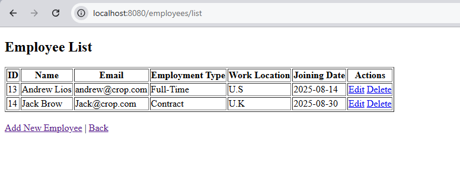

## Employee Management System

A Spring Boot + Thymeleaf project for managing employees, roles, and departments.    

## 📌 Features
- Add, update, delete employees
- Assign roles & departments
- KYC management
- Basic Authentication 

## 🛠️ Tech Stack
- **Backend**: Java, Spring Boot, Hibernate, Spring Security, REST APIs
- **Frontend**: Thymeleaf, HTML, CSS
- **Database**: MySQL
- **Tools**: Maven, Git,Postman, IntelliJ IDEA

## 📸 Project Screenshots
## 🏠 Dashboard
The dashboard provides a quick overview of employees, departments, and key actions available in the system.  

## 👨‍💼 Employee List
This page displays all employees with basic details, along with edit and delete options to update or remove records. 

